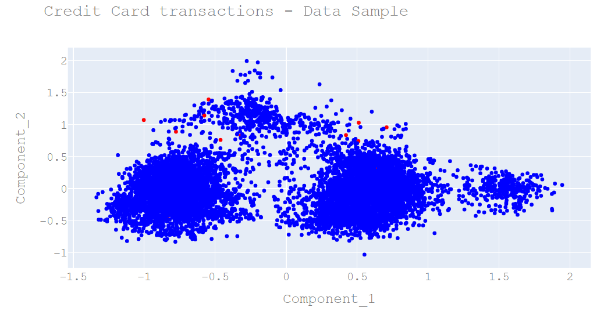

# Handling Imbalaced Datasets - Deep Learning

## Introduction
An imbalaced dataset is a dataset in which the class of interest (1), the minority class, is much rarer than the rest of the clases (0). 



Learning from imbalanced datasets like the one represented by the chart above is challenging and often leads to disappointing results if conventional ML techniques are applied. This happens because classifiers are based on optimization methods designed to improve overall accuracy and reduce error without considering the proportion / balance of classes. Such approach will often result in misclassifying the class of interest (The minority class) and lead to poor out of sample results; especially if the cost of missing the minority class is much higher than the cost of missing the majority class. This issue is predominant in problems where anomaly detection is decisive like fraudulent transaction in banks or identifying rare diseases. In this research project we will apply a Neural Network classifier along with a few tricks on a highly unbalanced dataset representing Credit Card transactions with a goal of correctly classify out of sample fraudulent transactions.     

## Acknowledgements
The dataset has been collected and analysed during a research collaboration of Worldline and the Machine Learning Group (http://mlg.ulb.ac.be) of ULB (Université Libre de Bruxelles) on big data mining and fraud detection. More details on current and past projects on related topics are available on https://www.researchgate.net/project/Fraud-detection-5 and the page of the DefeatFraud project.

## Dataset Description 

Source: https://www.kaggle.com/mlg-ulb/creditcardfraud
The datasets contains transactions made by credit cards in September 2013 by european cardholders. This dataset presents transactions that occurred in two days, where we have 492 frauds out of 284,807 transactions. The dataset is highly unbalanced, the positive class (frauds) account for 0.172% of all transactions.

It contains only numerical input variables which are the result of a PCA transformation. Unfortunately, due to confidentiality issues, we cannot provide the original features and more background information about the data. Features V1, V2, ... V28 are the principal components obtained with PCA, the only features which have not been transformed with PCA are 'Time' and 'Amount'. Feature 'Time' contains the seconds elapsed between each transaction and the first transaction in the dataset. The feature 'Amount' is the transaction Amount, this feature can be used for example-dependant cost-senstive learning. Feature 'Class' is the response variable and it takes value 1 in case of fraud and 0 otherwise.

Markdown is a lightweight and easy-to-use syntax for styling your writing. It includes conventions for

```markdown
Syntax highlighted code block

# Header 1
## Header 2
### Header 3

- Bulleted
- List

1. Numbered
2. List

**Bold** and _Italic_ and `Code` text

[Link](url) and 
```

For more details see [GitHub Flavored Markdown](https://guides.github.com/features/mastering-markdown/).

### Jekyll Themes

Your Pages site will use the layout and styles from the Jekyll theme you have selected in your [repository settings](https://github.com/SkanderSoltani/Imbalanced_Datasets/settings). The name of this theme is saved in the Jekyll `_config.yml` configuration file.

### Support or Contact

Having trouble with Pages? Check out our [documentation](https://help.github.com/categories/github-pages-basics/) or [contact support](https://github.com/contact) and we’ll help you sort it out.
